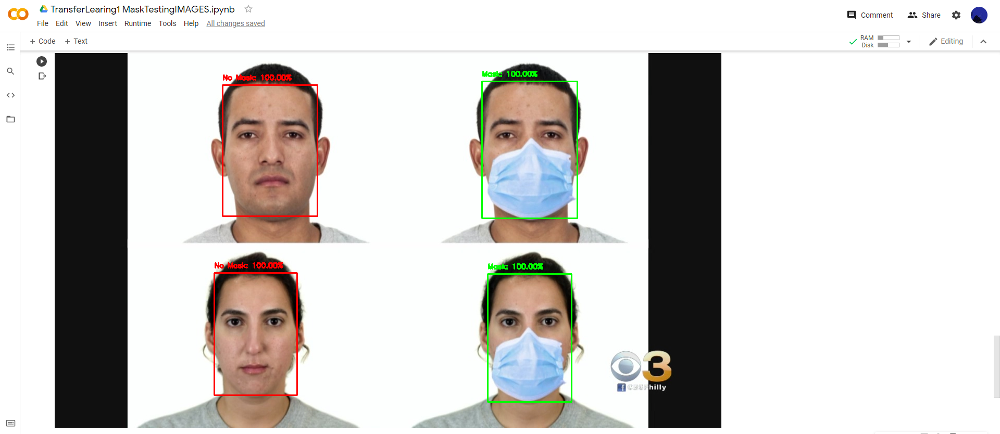
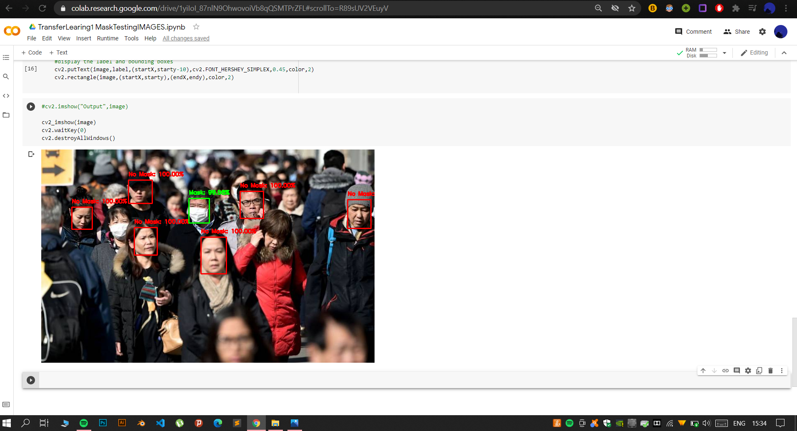

# Winter-Project-2020-2021
Image Classification Model Using Transfer Learning

## Description
>This model is made for Covid-19 mask detection using OpenCV, Keras/TensorFlow, and Deep Learning. It basically detects the faces of people and identifies if they are wearing a mask or not.

## Concepts
* Tranfer Learning Architecture: MobileNetCV2
* OpenCV: It's implementation is simply a continuous cycle of Detect Face, Slice Face Image, Pass through Classifier, Get and Display Prediction.
* The MobileNetV2 is followed by our DNN composed of GlobalAveragePooling, Dense and Dropout layers.

## Final Result

## Credits:
1. PyImageSearch https://www.pyimagesearch.com/2020/05...
2. Youtube video https://youtu.be/TNZAbVNTLhA

Dataset Link:- https://drive.google.com/folderview?id=1XDte2DL2Mf_hw4NsmGst7QtYoU7sMBVG
